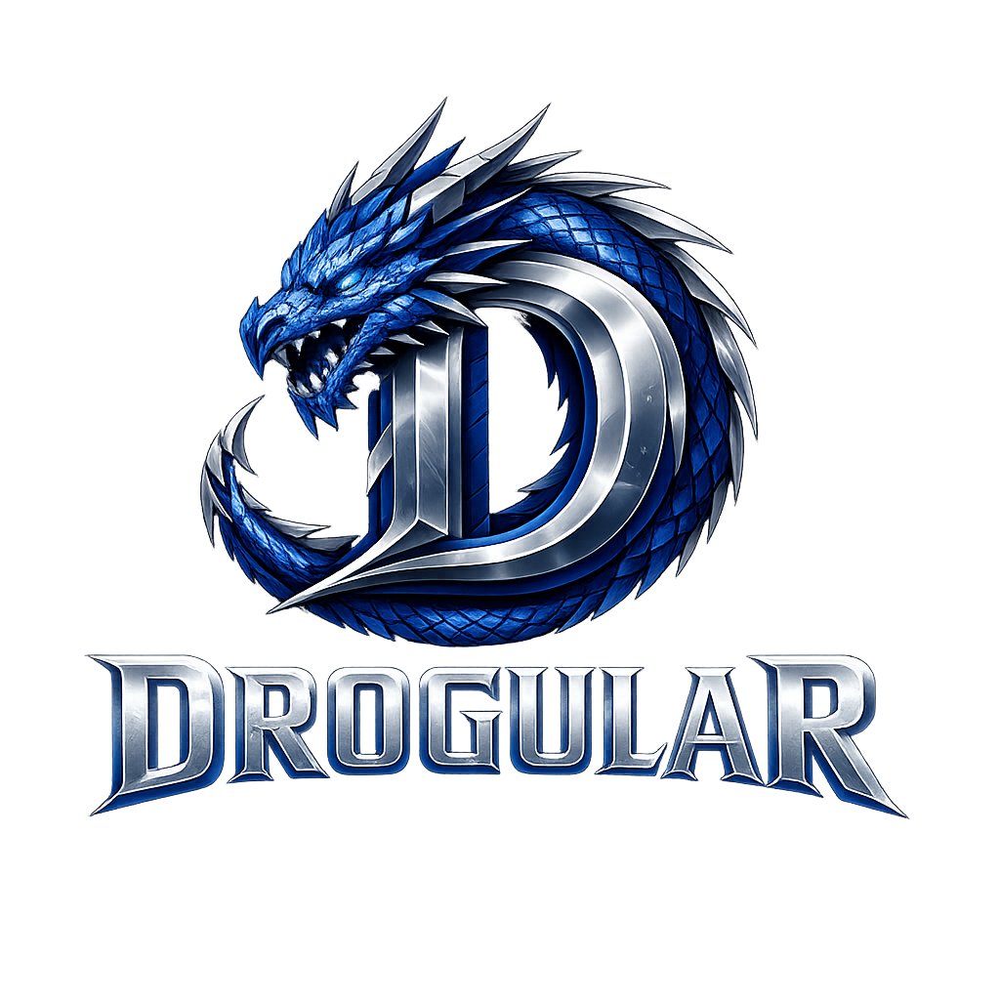

<p align="center">
    
</p>

# Drogular

> **Modern C++ application framework for Drogon with server-driven UI, GraphQL, PWA and extensible Developer Tools.**

Build modern web applications in C++ using a unified architecture for components, dependency injection, state management, GraphQL and Developer Tools.

**A cohesive application framework — not a collection of unrelated libraries.**

---

## Why Drogular?

Building modern web applications in C++ often requires combining independent libraries for routing, templates, dependency injection, state management, GraphQL clients and development tooling.

Drogular takes a different approach.

It provides these capabilities as parts of a single application framework with a consistent programming model. Pages, components, services, actions, state management, GraphQL integration and Developer Tools are designed to work together instead of being assembled from unrelated libraries.

---

## Core Principles

- 🧩 Component-based architecture
- ⚡ Server-rendered UI with progressive enhancement where needed
- 💉 Dependency Injection everywhere
- 🔄 Reactive State Management
- 🌐 Native GraphQL integration
- 🌍 Built-in Localization
- 📱 Progressive Web Apps
- 🛠 Developer Tools built on public APIs
- 🔌 Extensible architecture
- 🚀 Built-in project generator and developer CLI

---

## Architecture

```text
Application
    ├── Pages
    ├── Components
    ├── Services
    ├── Actions
    ├── State
    ├── GraphQL
    ├── Localization
    └── Developer Tools
```

Every subsystem follows the same architectural principles, creating a consistent programming model throughout the application.

---

## Developer Tools

Developer Tools are a first-class part of Drogular rather than an external utility.

```text
             Application

                   │
                   ▼
       Application Inspection

                   │
                   ▼
          Inspection JSON API

        ┌──────────┴──────────┐
        ▼                     ▼
 Diagnostics Page      External Tools
```

Developer Tools include:

- Development Profile
- Built-in Diagnostics
- Application Inspection
- Extensible Inspection Contributors
- Custom Developer Components
- Public JSON contract for external tools
- IDE-ready architecture

Applications and libraries can contribute their own inspection sections and custom visualizations without modifying Drogular itself.

---

## Reference Application

**PortalDemo** is the reference application for Drogular.

It demonstrates the recommended architecture, including:

- Authentication
- Dependency Injection
- Components
- Reactive State Management
- GraphQL
- Localization
- Developer Tools

Rather than being a collection of isolated examples, PortalDemo shows how these features work together in a complete application.

---

## Examples

| Example | Demonstrates |
|----------|--------------|
| TodoPWA | Components, State Management, Forms & Validation |
| Auth Sample | Authentication & Sessions |
| Developer Tools | Extending the Developer Tools platform |
| Repository Sample | Repository pattern and data access |
| System Monitor PWA | Live server-rendered fragments, PWA behavior, and remote/system hardware monitoring |
| PortalDemo | Complete reference application architecture |

---

## Quick Start

The fastest way to start a Drogular application is with the CLI:

```bash
drogular new hello_drogular
cd hello_drogular
cmake -S . -B build
cmake --build build
./build/hello_drogular
```

The generated project is pinned to the matching Drogular release and includes a Page, reusable Component, templates, 
public assets, and the recommended startup structure.

The CLI also supports explicit output paths and multiple embedded starters:

```bash
drogular templates
drogular new examples/admin --template minimal
drogular new apps/MyPWA --template pwa
```

`minimal` is the smallest recommended Drogular application. `pwa` is a ready-to-run installable starter with a manifest
, service worker, offline fallback, responsive UI, and short `Tip:` comments that explain the important extension points.

A complete minimal route needs only a Page and `drogular::App`:

```cpp
#include <drogular/app.hpp>
#include <drogular/page.hpp>
#include <drogular/render_context.hpp>

#include <string>

class HomePage final : public drogular::Page
{
public:
    std::string render(drogular::RenderContext&) override
    {
        return "<h1>Hello Drogular</h1>";
    }
};

int main()
{
    drogular::App app;

    app.page<HomePage>("/");
    app.run(8080);

    return 0;
}
```

The [Getting Started](docs/getting-started/README.md) guide adds the required CMake setup, templates, Components, services, dependency injection, CLI workflow, and project organization.

---

## Feature Overview

| Feature | Status |
|----------|:------:|
| Components | ✅ |
| Routing | ✅ |
| Dependency Injection | ✅ |
| State Management | ✅ |
| Forms & Validation | ✅ |
| GraphQL Integration | ✅ |
| Localization | ✅ |
| Progressive Web Apps | ✅ |
| Developer Tools | ✅ |

---

## What's New in 0.22

Drogular 0.22 focuses on developer productivity and making the path from an installed CLI to a working application fast and reproducible.

- 🚀 Reusable project generator with embedded project templates
- 🧰 Developer-focused `drogular` CLI with destination-path support and template discovery
- 🧩 `minimal` starter with the recommended Drogular project structure and concise `Tip:` guidance
- 📱 Installable `pwa` starter with manifest, service worker, offline fallback, responsive UI, and application icons
- 🛡 Safer generation with path validation, overwrite protection, and cleanup after failures
- 🧪 End-to-end smoke tests that generate, configure, compile, and link both official starters
- 📊 New System Monitor PWA example with live monitoring, reconnect/offline behavior, SSH, and Raspberry Pi hardware inspection

See [RELEASE_NOTES_0.22.md](RELEASE_NOTES_0.22.md) for the complete release notes.

---

## Documentation

- 📖 [Getting Started](docs/getting-started/README.md)
- 🍳 [Cookbook](docs/cookbook/README.md)
- 🏗 [Architecture](docs/architecture/README.md)
- 📚 [API Reference](docs/reference/README.md)
- 🧩 [Examples](examples/)
- 🚀 [PortalDemo Reference Application](examples/portal_demo/)

---

## Roadmap

### 0.23 — Server-driven UI & Framework Foundations

Drogular 0.23 is turning the successful System Monitor experiments into reusable framework capabilities while keeping JavaScript and CSS optional, small, and composable. The first framework-level Drogular Interactions and Drogular UI APIs are now in place and System Monitor has been migrated to consume them.

**Drogular Interactions**

- Declarative fragment requests and form commands with `dg-get`, `dg-post`, `dg-target`, and `dg-trigger`
- Load, polling, change, and debounced input triggers
- Standard loading, ready, empty, and error states
- Polling groups for coordinated live UI
- Failure limits with pause and explicit resume
- Framework-served `/__drogular/assets/interactions.js` via opt-in `app.interactions()`
- Interaction runtime separated from application-specific connection/status markup through `data-dg-connection-*`
- First-class Component / Fragment rendering from Actions with `ActionRenderer`
- Interaction-aware Actions through `ActionContext::isInteraction()`
- URL/history synchronization plus success refresh/navigation for mutation flows

**Drogular UI**

A small optional UI foundation rather than a full CSS framework:

- `dg-button`
- `dg-card`
- `dg-toolbar`
- `dg-status`
- `dg-badge`
- `dg-segmented`
- Semantic variants: `neutral`, `info`, `success`, `warning`, and `danger`
- Framework-served `/__drogular/assets/ui.css` via opt-in `app.ui()`

The System Monitor reference application also validates a server-driven presentation model: C++ Components choose semantic state and UI variants, templates compose the primitives, and Drogular UI owns the shared visual treatment. Application-specific layout, branding, and domain presentation remain application-owned.

Drogular UI and Drogular Interactions are intentionally independent: applications can use either one alone or combine them. The goal is to remove repeated presentation boilerplate without turning Drogular into a general-purpose CSS framework.

**Template Engine cleanup**

- Precompile interpolation expressions
- Compile component tags/attributes into semantic AST
- Split `template_runtime.cpp`
- Split Expression parser/lexer
- Integer `ExpressionValue`
- Runtime diagnostics for custom functions

### 1.0

- Stable Public API
- Production Ready
- Long-term API Compatibility

## Design Philosophy

Drogular is designed around one simple idea:

> **Every subsystem should feel like a natural part of the framework.**

Components, dependency injection, state management, GraphQL integration, localization and Developer Tools all follow the same architectural principles, creating a consistent programming model across the entire application.

The goal of Drogular is not simply to provide more features, but to provide a cohesive framework where those features naturally work together.